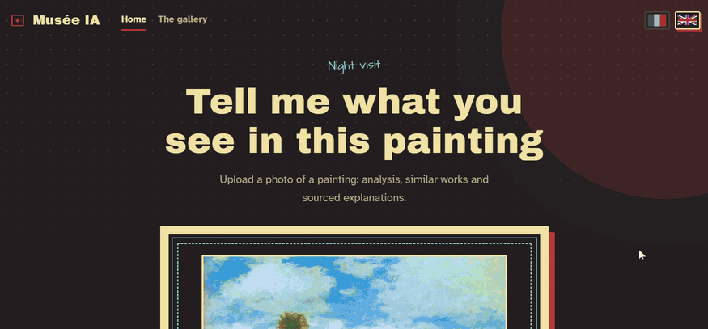
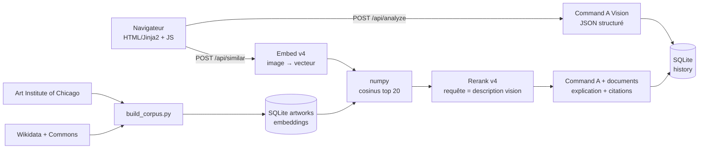

<sub>Vidéo pleine qualité avec le son : <a href="apercu/POC.mp4">apercu/POC.mp4</a>.</sub>

# Musée IA - « Dis-moi ce que tu vois dans ce tableau »

[English](README.md) · **Français**

Envoyez la photo d'un tableau : un modèle vision de Cohere en explique le mouvement, la technique et le contexte, puis
l'application propose des œuvres proches d'un petit corpus du domaine public (embeddings, puis rerank) et justifie
chaque rapprochement par des **citations** limitées aux métadonnées du corpus.

## Lancer le projet (Windows, Python 3.10+)

```powershell
pip install -r requirements.txt
copy .env.example .env          # puis renseigner COHERE_API_KEY
python -m app.cohere_svc       # vérifie que la clé fonctionne (~5 tokens)
python -m scripts.build_corpus  # construit le corpus (~230 peintures) + embeddings, reprenable
python -m app                  # http://127.0.0.1:8000
```

Optionnel :

```powershell
python -m scripts.neighbors mon_tableau.jpg   # test isolé : 5 plus proches voisins + scores
python -m scripts.eval                        # precision@5 : embeddings seuls vs embeddings + rerank
python -m scripts.eval --seeds 0,1,2          # idem sur 3 échantillons différents (moyenne ± écart-type)
pip install -r requirements-dev.txt && python -m pytest   # tests (aucun appel à Cohere, base temporaire)
```

> La clé gratuite « Trial » de Cohere est réservée à un usage non commercial et limitée en appels : le projet se
> lance en local avec votre propre clé et n'est volontairement pas déployé publiquement.

`build_corpus` est idempotent : après un quota 429 ou un Ctrl-C, relancez-le, il ne traite que ce qui manque.
`--scale 0.2` construit un mini corpus de test.

## Architecture



Deux requêtes : l'analyse s'affiche dès qu'elle est prête, puis arrivent les œuvres proches. Si le rerank ou le
grounding échoue, l'application dégrade proprement (ordre des embeddings, pas d'explication citée) et affiche un
message clair.

| Étape | Modèle Cohere (surchargeable via `COHERE_MODEL_*` dans `.env`) |
|---|---|
| Analyse du tableau | `command-a-vision-07-2025` (chat v2, sortie JSON schema) |
| Embeddings image | `embed-v4.0` |
| Re-classement | `rerank-v4.0-pro` |
| Explication groundée | `command-a-03-2025` (chat v2 avec `documents` → citations) |

SDK `cohere` 7.x (`ClientV2`). Le modèle d'embedding est stocké avec chaque vecteur : changer `COHERE_MODEL_EMBED` puis
relancer `python -m scripts.build_corpus` ré-embarque tout, sans jamais mélanger deux espaces vectoriels.

## Corpus

~230 peintures du domaine public, 11 mouvements, source et licence affichées sur chaque carte.

* **Art Institute of Chicago** : impressionnisme, post-impressionnisme, réalisme, baroque, néoclassicisme,
  Renaissance, maniérisme.
* **Wikidata + Wikimedia Commons** : romantisme, expressionnisme, cubisme, art nouveau (artiste mort avant 1955 et
  licence Commons vérifiée). Cette source comble les mouvements absents d'AIC une fois filtré sur le domaine public.

## Choix techniques

* **FastAPI + Jinja2 + JS sans framework** : application légère, pas de build front.
* **SQLite (`sqlite3`, requêtes paramétrées, sans ORM)** : `artworks`, `history`, `settings`. L'historique ne garde que
  les métadonnées et le résultat, jamais l'image.
* **Recherche vectorielle en numpy** : 230 vecteurs ≈ 1,5 Mo, une base vectorielle n'apporterait que de la complexité
  (pgvector/Qdrant se justifient vers 10⁵ vecteurs).
* **Analyse structurée** (JSON schema), avec repli « JSON libre + extraction ». Le champ `is_painting` gère les
  photos non pertinentes ; artiste et mouvement portent un niveau de confiance, « inconnu » est une réponse valide.
* **Grounding en appel séparé** : `response_format` n'est pas compatible avec `documents`. L'explication ne peut citer
  que les métadonnées fournies.
* **Rerank sur texte** : documents = métadonnées des œuvres, requête = description visuelle du modèle vision. C'est
  une passerelle texte ↔ métadonnées, pas un correcteur de similarité visuelle.
* **Image traitée en mémoire** (Pillow : validation, redimensionnement), jamais écrite sur disque.
* **Proxy d'images `/art/{id}`** : l'URL est lue en base (pas d'URL client, donc pas de SSRF) et l'image est mise en
  cache ; la CSP reste `img-src 'self'`.

## Sécurité

Clé dans `.env` (ignoré par git) et jamais exposée au front · CSP stricte, `nosniff`, `no-referrer` · aucun
`innerHTML` côté JS, métadonnées externes traitées comme non fiables · upload limité à 5 Mo, type vérifié sur le
contenu réel · timeouts et backoff sur 429/5xx · erreurs lisibles, jamais de stacktrace.

## Évaluation

Leave-one-out sur le corpus (232 œuvres) : precision@5 sur le **même mouvement** (`python -m scripts.eval`, résultats
dans `data/eval_results.json`). Le rerank est évalué sur un échantillon stratifié de 61 œuvres (appels API payants en
quota) ; la ligne « embeddings seuls » est donc **recalculée sur ces mêmes 61 œuvres**, seule comparaison valable.

| Méthode | precision@5 | hors même artiste | n |
|---|---|---|---|
| Hasard | 0,099 | 0,099 | 232 |
| Embeddings seuls, corpus entier | 0,491 | 0,405 | 232 |
| Embeddings seuls, **mêmes 61 œuvres que le rerank** | 0,423 | 0,344 | 61 |
| Embeddings + rerank, **aveugle** (documents sans mouvement) | 0,433 | 0,393 | 61 |
| Embeddings + rerank, avec mouvement dans les documents (circulaire, voir ci-dessous) | 0,515 | 0,459 | 61 |

Ce qu'on peut en conclure, et ce qu'on ne peut pas :

* Les embeddings captent bien le style : ≈ 5× le hasard, sur le corpus entier.
* **Le gain « avec mouvement » est en partie circulaire** : les documents contiennent le mouvement et on évalue sur le
  mouvement. C'est la configuration de l'application, mais ce n'est pas une mesure de qualité visuelle.
* La mesure honnête est la variante **aveugle** : +0,010 sans l'exclusion d'artiste, +0,049 avec. Avec 61 requêtes
  (erreur-type de l'ordre de 0,04), **ce gain ne permet pas de conclure** (test apparié non réalisé). Le rerank sert surtout de passerelle
  texte ↔ métadonnées (justification, citations), pas de correcteur de similarité visuelle.
* **Une seule exécution** (graine 0, 2026-10-05). L'écart entre l'échantillon (0,423) et le corpus entier (0,491) pour
  les mêmes embeddings montre l'effet du tirage. `python -m scripts.eval --seeds 0,1,2` répète le rerank sur trois
  échantillons différents et affiche moyenne ± écart-type ; les résultats ci-dessus n'en sont pas issus.

## Limites

* Étiquettes de mouvement issues des sources (bruitées), pas d'un historien de l'art.
* Corpus petit et déséquilibré (5 œuvres en maniérisme, 30 en impressionnisme).
* Embedding sensible au cadrage des photos (reflets, cadre, angle).
* L'identification d'artiste est une estimation.

## Arborescence

```
app/                    le serveur et ses services
  main.py               FastAPI : routes, erreurs, CSP, proxy d'images
  cohere_svc.py         vision · embeddings · rerank · grounding
  search.py             cosinus numpy + PCA 2D
  db.py · config.py · i18n.py · imaging.py
  templates/ static/    interface (Jinja2, CSS, JS)
scripts/                outils en ligne de commande
  build_corpus.py       AIC + Wikidata/Commons → artworks → embeddings
  neighbors.py          test isolé : image → 5 voisins
  eval.py               precision@5 : embeddings vs rerank
tests/                  pytest : cosinus, accès base, validation d'upload
data/                   musee.db et caches (non versionnés), résultats d'évaluation
```
