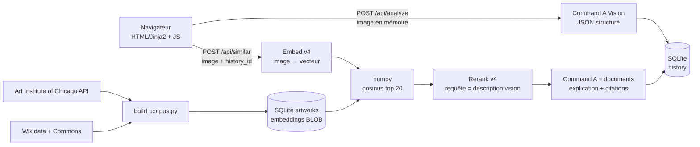

# Musée IA — « Dis-moi ce que tu vois dans ce tableau »

L'utilisateur envoie la photo d'un tableau. Un modèle vision de Cohere explique le mouvement, la technique et le
contexte ; l'application propose ensuite des œuvres proches d'un petit corpus du domaine public (recherche par
embeddings, puis rerank) et justifie chaque rapprochement avec des **citations** limitées aux métadonnées du corpus.

Projet de démonstration pour un poste de *Forward Deployed Engineer* : il assemble vision/chat, embeddings, rerank et
grounding avec citations, et documente évaluation, limites et choix.

Interface bilingue FR / EN (drapeaux en haut à droite) · thèmes : salle de musée la nuit.

---

## Démarrage (Windows, Python 3.10+)

```powershell
pip install -r requirements.txt
copy .env.example .env          # puis renseigner COHERE_API_KEY
python cohere_svc.py            # 1) prouve que la clé fonctionne (un appel de ~5 tokens)
python build_corpus.py          # 2) corpus : ~230 peintures, embeddings Embed v4 (reprenable)
python neighbors.py mon_tableau.jpg   # 3) test isolé : 5 plus proches voisins + scores
python main.py                  # 4) http://127.0.0.1:8000
python eval.py                  # 5) precision@5 : embeddings seuls vs embeddings + rerank
```

`build_corpus.py` est **idempotent et reprenable** : relancez-le après un quota 429 ou un Ctrl-C, il ne ré-embarque
que ce qui manque (et uniquement si le modèle d'embedding a changé). `--scale 0.2` construit un mini corpus de test.

## Modèles Cohere réellement utilisés

Identifiants vérifiés sur [docs.cohere.com/docs/models](https://docs.cohere.com/docs/models) le 2026-10-05, tous au
statut *Live*. Ils sont surchargeables dans `.env` (`COHERE_MODEL_*`).

| Étape | Modèle | Appel |
|---|---|---|
| Analyse du tableau | `command-a-vision-07-2025` | `chat` v2, image en data-URL, `response_format` JSON schema |
| Embeddings (image → vecteur) | `embed-v4.0` | `embed` v2, `input_type="image"`, `embedding_types=["float"]` |
| Re-classement | `rerank-v4.0-pro` | `rerank` v2, requête = description de l'étape vision |
| Explication groundée | `command-a-03-2025` | `chat` v2 avec `documents` → `message.citations` |

SDK : `cohere` 7.x, `ClientV2`. Des successeurs existent déjà dans la doc (`embed-v5.0-pro`, `command-a-plus-05-2026`,
`rerank-v4.0-fast`). Le brief demandait Embed v4 : c'est le choix par défaut ; pour comparer, changez
`COHERE_MODEL_EMBED`, relancez `python build_corpus.py` (il détecte le changement de modèle et ré-embarque) puis
`python eval.py`. Le schéma de la base stocke le modèle utilisé pour chaque vecteur, donc on ne mélange jamais deux
espaces vectoriels.

## Architecture



Deux requêtes plutôt qu'une : l'analyse (≈ 5-10 s) s'affiche dès qu'elle est prête, puis les œuvres proches arrivent.
Si le rerank ou le grounding échoue, l'application **dégrade proprement** (ordre des embeddings, pas d'explication
groundée) et continue d'afficher le reste, avec un message clair.

### Routes

| Route | Rôle |
|---|---|
| `GET /`, `GET /salle` | pages (Jinja2) |
| `POST /api/analyze` | upload multipart → analyse vision, création de l'entrée d'historique |
| `POST /api/similar` | embedding → top 20 → rerank → top 5 → explication groundée |
| `GET /api/history`, `GET /api/history/{id}`, `DELETE /api/history` | historique (10 dernières) |
| `GET/PUT /api/settings` | langue (fr/en) et niveau (débutant/passionné/expert) |
| `GET /api/corpus` | statistiques + projection PCA 2D (page `/salle`) |
| `GET /art/{id}` | proxy d'images du corpus (voir plus bas) |
| `GET /api/ping`, `GET /api/status` | test de la clé, état de l'installation |

### Base SQLite (`musee.db`, module `sqlite3`, requêtes paramétrées, pas d'ORM)

* `artworks` : id, titre, artiste, année, mouvement, médium, `image_url`, `source_url`, source, licence,
  `embedding` (BLOB float32), `embedding_model`
* `history` : date, langue, niveau, résumé, `result_json` (métadonnées + résultat, **jamais l'image**)
* `settings` : langue, niveau d'explication

## Corpus

~230 peintures, 11 mouvements, uniquement du domaine public, avec **source et licence affichées sur chaque carte**.

* **Art Institute of Chicago** (`api.artic.edu`) : `is_public_domain = true`, type *Painting*. Impressionnisme,
  post-impressionnisme, réalisme, baroque, néoclassicisme, Renaissance, maniérisme.
* **Wikidata + Wikimedia Commons** : romantisme, expressionnisme, cubisme, art nouveau. Artiste mort avant 1955 **et**
  licence Commons vérifiée par l'API (`extmetadata`).

**Pourquoi une source de plus ?** Le brief demandait AIC seul, mais une fois filtré sur le domaine public, AIC ne
contient ni expressionnisme, ni romantisme, ni surréalisme (0 œuvre ; seulement 3 en cubisme) : l'étiquette
« mouvement » vient de leur champ `style_titles`, et l'art du XXᵉ siècle est surtout sous droits. Wikidata (propriété
« mouvement », P135) comble ces trous. **Surréalisme exclu** : presque tous les surréalistes sont morts après 1954,
donc leurs œuvres ne sont pas libres dans l'UE (2 résultats seulement dans Wikidata).

## Choix techniques assumés

* **Recherche vectorielle en numpy** (cosinus en mémoire) : 230 vecteurs d'environ 1,5 k dimensions en float32 ≈ 1,5 Mo. Une base
  vectorielle n'apporterait que de la complexité ; le passage à `pgvector`/Qdrant se justifie vers 10⁵-10⁶ vecteurs.
* **Sortie structurée** pour l'analyse vision (JSON schema) ; repli sur « JSON libre + extraction » si le point d'accès
  refuse le schéma avec une image. Le champ `is_painting` gère les photos / captures d'écran.
* **Le grounding est un appel séparé** : la doc Cohere indique que `response_format` n'est pas pris en charge avec
  `documents`. L'analyse (structurée) et l'explication (citée) sont donc deux appels, ce qui est aussi plus lisible.
* **Rerank** : travaille sur du texte. Les documents sont les métadonnées de chaque œuvre ; la requête est la
  description visuelle produite par le modèle vision (`search_description_en`, en anglais, sans nom d'artiste).
  Il apporte donc un signal sémantique *texte* que le cosinus d'image n'a pas.
* **Honnêteté du modèle** : l'artiste et le mouvement portent un niveau de confiance, « inconnu » est une réponse
  valide ; l'explication groundée n'a le droit de citer que les métadonnées fournies, et dit quand le lien n'est pas
  étayé.
* **Image jamais stockée** : traitée en mémoire (Pillow : validation réelle du contenu, aplatissement, redimensionnement)
  et jamais écrite sur disque. L'historique ne garde que les métadonnées et le résultat.
* **Proxy d'images `/art/{id}`** : AIC exige un en-tête `AIC-User-Agent` qu'une balise `` ne peut pas envoyer, et
  Wikimedia redirige vers d'autres domaines. Le serveur récupère l'image depuis l'URL **lue en base** (pas d'URL
  fournie par le client → pas de SSRF), la met en cache (`data/cache/art/`) et la sert : la CSP reste `img-src 'self'`.
* **Latence et modèles affichés** pour chaque étape (bloc « Pipeline » sous les résultats).

## Sécurité et robustesse

* Clé dans `.env` (ignoré par git), jamais exposée au front ; `.env.example` fourni.
* Actions qui modifient l'état en `POST`/`PUT`/`DELETE` uniquement.
* Côté JS : aucun `innerHTML` ; tout passe par `textContent`. Les métadonnées externes sont traitées comme non fiables
  (URLs filtrées sur http/https, `rel="noopener noreferrer"`). Vérifié par un test navigateur injectant du HTML dans
  une réponse : il reste affiché comme texte.
* CSP stricte (`script-src 'self'`, pas de style ni de script inline), `nosniff`, `no-referrer`.
* Requêtes SQL paramétrées uniquement. Upload : 5 Mo max, types jpeg/png/webp contrôlés **sur le contenu réel**.
* Timeouts : 15 s sur les appels HTTP externes, 30 s sur Cohere. Backoff exponentiel sur 429/5xx
  (2 tentatives courtes en interactif ; jusqu'à ~3 min cumulées pour `build_corpus.py` et `eval.py`).
* Erreurs en clair (FR/EN), jamais de stacktrace : image qui n'est pas un tableau, trop lourde, mauvais format, quota
  dépassé, clé absente/refusée, service Cohere indisponible, corpus vide.
* Boutons désactivés + indicateur pendant les appels.

## Évaluation (`python eval.py`)

Leave-one-out sur le corpus : pour chaque œuvre, on la retire, on cherche ses voisins et on mesure la proportion
des 5 premiers qui ont le **même mouvement** (precision@5). Comparaison : embeddings seuls vs embeddings + rerank
(top 20 → top 5), avec deux garde-fous :

* **« hors même artiste »** : sans lui, on mesure surtout « retrouver un autre tableau du même peintre ».
* **rerank « aveugle » vs « avec mouvement »** : si les documents contiennent le mouvement, l'étiquette fuite dans le
  classement ; la variante aveugle mesure le gain réel de similarité. L'application utilise la variante « avec
  mouvement », parce que ces métadonnées sont de l'information légitime à montrer à l'utilisateur.

La requête de rerank est la description produite par Command A Vision à partir de l'image de chaque œuvre, comme
dans l'application (le rerank est évalué sur un échantillon stratifié de 60 œuvres pour rester dans les quotas d'une
clé gratuite ; les descriptions sont mises en cache).

### Résultats

> **À remplir après la première exécution avec une vraie clé** : `python eval.py` écrit
> `data/eval_results.json` et affiche le tableau. Aucun chiffre n'est inscrit ici tant qu'il n'a pas été mesuré.

## Limites connues

* **Étiquettes de mouvement bruitées.** Elles viennent des sources, pas d'un historien de l'art : AIC classe Claude
  Lorrain en « Réalisme », Wikidata classe Gainsborough en « Romantisme ». La precision@5 mesure donc l'accord avec ces
  étiquettes, pas la vérité en histoire de l'art.
* **Corpus petit et déséquilibré** (5 œuvres en maniérisme, 30 en impressionnisme) ; un mouvement sans œuvre
  proche dans le corpus (surréalisme, fauvisme…) ne peut pas être retrouvé.
* **Photos de tableaux** (reflets, cadre, angle) : l'embedding est sensible au cadrage ; pas de recadrage automatique.
* **Rerank sur métadonnées uniquement** : il ne « voit » pas l'image des œuvres du corpus.
* **Biais du modèle vision** : l'identification d'artiste est une estimation, d'où les niveaux de confiance.
* **Les mouvements affichés sont en anglais dans le corpus** (traduits côté UI pour le français ; les titres
  restent dans leur forme source).
* Projection PCA 2D : visualisation qualitative, les distances 2D ne sont pas les distances réelles.

## Ce que je changerais pour un vrai client

* **Index vectoriel** (pgvector / Qdrant) au-delà de ~10⁵ œuvres, avec filtrage par métadonnées ; embeddings
  `int8`/`binary` pour réduire la mémoire.
* **Jeu d'évaluation étiqueté par des experts** (pas des étiquettes de sources), avec métriques de rang (nDCG, MRR) et
  juge humain pour les explications ; évaluation de la fidélité des citations (chaque affirmation retrouve-t-elle sa
  source ?).
* **Embeddings des textes + images** (`inputs` mixtes) et recherche hybride (BM25 + vecteurs) ; test A/B
  `embed-v4.0` vs `embed-v5.0-pro`.
* **Observabilité** : traces par requête (latence par étape, tokens, coût), alertes sur les 429 et les dérives de
  qualité ; cache des résultats d'embedding par hash d'image.
* **File de tâches + streaming** (SSE) plutôt que deux requêtes synchrones ; gestion de quota par utilisateur.
* **Authentification, limites de débit, stockage chiffré** de l'historique, politique de rétention RGPD.
* **Déploiement** : conteneur, secrets dans un coffre, CI avec les tests et l'évaluation comme garde-fou de régression.
* **Gouvernance du contenu** : revue des licences à chaque ajout de source, sans dépendre d'un indicateur unique.

## Arborescence

```
main.py            FastAPI : routes, erreurs propres, CSP, proxy d'images
cohere_svc.py      vision · embeddings · rerank · grounding (+ backoff, erreurs)
build_corpus.py    AIC + Wikidata/Commons → artworks → Embed v4 (idempotent, reprenable)
neighbors.py       test isolé : image locale → 5 voisins + scores
eval.py            leave-one-out : precision@5, embeddings vs rerank
search.py          cosinus numpy + PCA 2D
db.py · config.py · i18n.py · imaging.py
templates/ static/ interface (Jinja2, CSS, JS sans framework)
```
