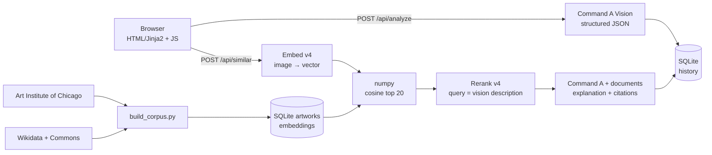

<sub>Full-quality video with sound: <a href="apercu/POC.mp4">apercu/POC.mp4</a>.</sub>

# Musée IA - "Tell me what you see in this painting"

**English** · [Français](README.fr.md)

Upload a photo of a painting: a Cohere vision model explains its movement, technique and context, then the app finds
similar works in a small public-domain corpus (embeddings, then rerank) and justifies each match with **citations**
restricted to the corpus metadata.

## Run it (Windows, Python 3.10+)

```powershell
pip install -r requirements.txt
copy .env.example .env          # then fill in COHERE_API_KEY
python -m app.cohere_svc       # checks that the key works (~5 tokens)
python -m scripts.build_corpus  # builds the corpus (~230 paintings) + embeddings, resumable
python -m app                  # http://127.0.0.1:8000
```

Optional:

```powershell
python -m scripts.neighbors my_painting.jpg   # isolated test: 5 nearest neighbours + scores
python -m scripts.eval                        # precision@5: embeddings only vs embeddings + rerank
python -m scripts.eval --seeds 0,1,2          # same, over 3 different samples (mean ± std)
pip install -r requirements-dev.txt && python -m pytest   # tests (no Cohere calls, temporary database)
```

`build_corpus` is idempotent: after a 429 quota error or a Ctrl-C, run it again and it only processes what is missing.
`--scale 0.2` builds a small test corpus.

> Cohere's free Trial key is non-commercial and rate-limited, so the project is meant to be run locally with your own
> key and is deliberately not deployed publicly.

## Architecture



Two requests: the analysis is displayed as soon as it is ready, then the similar works arrive. If rerank or grounding
fails, the app degrades gracefully (embedding order, no cited explanation) and shows a clear message.

| Step | Cohere model (overridable via `COHERE_MODEL_*` in `.env`) |
|---|---|
| Painting analysis | `command-a-vision-07-2025` (chat v2, JSON-schema output) |
| Image embeddings | `embed-v4.0` |
| Reranking | `rerank-v4.0-pro` |
| Grounded explanation | `command-a-03-2025` (chat v2 with `documents` → citations) |

`cohere` SDK 7.x (`ClientV2`). The embedding model is stored with each vector: changing `COHERE_MODEL_EMBED` and
re-running `python -m scripts.build_corpus` re-embeds everything, never mixing two vector spaces.

## Corpus

~230 public-domain paintings, 11 movements, source and licence shown on every card.

* **Art Institute of Chicago**: impressionism, post-impressionism, realism, baroque, neoclassicism, Renaissance,
  mannerism.
* **Wikidata + Wikimedia Commons**: romanticism, expressionism, cubism, art nouveau (artist died before 1955 and
  Commons licence verified). This source fills the movements missing from AIC once filtered to the public domain.

## Technical choices

* **FastAPI + Jinja2 + vanilla JS**: lightweight, no front-end build.
* **SQLite (`sqlite3`, parameterised queries, no ORM)**: `artworks`, `history`, `settings`. History keeps only
  metadata and the result, never the image.
* **Vector search in numpy**: 230 vectors ≈ 1.5 MB; a vector database would only add complexity (pgvector/Qdrant make
  sense around 10⁵ vectors).
* **Structured analysis** (JSON schema), with a "free JSON + extraction" fallback. The `is_painting` field handles
  irrelevant photos; artist and movement carry a confidence level, "unknown" is a valid answer.
* **Grounding in a separate call**: `response_format` is not compatible with `documents`. The explanation can only
  cite the metadata it is given.
* **Rerank on text**: documents = artwork metadata, query = the vision model's visual description. It bridges text and
  metadata; it is not a visual-similarity corrector.
* **Images handled in memory** (Pillow: validation, resizing), never written to disk.
* **Image proxy `/art/{id}`**: the URL is read from the database (no client-supplied URL, hence no SSRF) and the image
  is cached; the CSP stays `img-src 'self'`.

## Security

Key in `.env` (git-ignored) and never exposed to the front end · strict CSP, `nosniff`, `no-referrer` · no `innerHTML`
in the JS, external metadata treated as untrusted · uploads capped at 5 MB, type checked on the real content ·
timeouts and backoff on 429/5xx · readable errors, never a stack trace.

## Evaluation

Leave-one-out over the corpus (232 works): precision@5 on the **same movement** (`python -m scripts.eval`, results in
`data/eval_results.json`). Rerank is evaluated on a stratified sample of 61 works (API calls count against quota), so
the "embeddings only" line is **recomputed on those same 61 works**, the only valid comparison.

| Method | precision@5 | excluding same artist | n |
|---|---|---|---|
| Random | 0.099 | 0.099 | 232 |
| Embeddings only, full corpus | 0.491 | 0.405 | 232 |
| Embeddings only, **same 61 works as the rerank** | 0.423 | 0.344 | 61 |
| Embeddings + rerank, **blind** (documents without the movement) | 0.433 | 0.393 | 61 |
| Embeddings + rerank, movement in the documents (circular, see below) | 0.515 | 0.459 | 61 |

What this does and does not show:

* Embeddings capture style well: ≈ 5× random on the full corpus.
* **The "movement in the documents" gain is partly circular**: the documents contain the movement and we evaluate on
  the movement. It is the app's configuration, but it is not a measure of visual quality.
* The honest measure is the **blind** variant: +0.010 without artist exclusion, +0.049 with it. With 61 queries
  (standard error around 0.04), **this gain is inconclusive** (no paired test was run). Rerank mainly serves as a
  text ↔ metadata bridge (justification, citations), not as a visual-similarity corrector.
* **Single run** (seed 0, 2026-10-05). The gap between the sample (0.423) and the full corpus (0.491) for the very same
  embeddings shows the effect of sampling. `python -m scripts.eval --seeds 0,1,2` repeats the rerank on three
  different samples and reports mean ± std; the numbers above do not come from it.

## Limitations

* Movement labels come from the sources (noisy), not from an art historian.
* Small, unbalanced corpus (5 works in mannerism, 30 in impressionism).
* Embeddings are sensitive to photo framing (glare, frame, angle).
* Artist identification is an estimate.

## Layout

```
app/                    the server and its services
  main.py               FastAPI: routes, errors, CSP, image proxy
  cohere_svc.py         vision · embeddings · rerank · grounding
  search.py             numpy cosine + 2D PCA
  db.py · config.py · i18n.py · imaging.py
  templates/ static/    UI (Jinja2, CSS, JS)
scripts/                command-line tools
  build_corpus.py       AIC + Wikidata/Commons → artworks → embeddings
  neighbors.py          isolated test: image → 5 neighbours
  eval.py               precision@5: embeddings vs rerank
tests/                  pytest: cosine, database access, upload validation
data/                   musee.db and caches (not versioned), evaluation results
```
